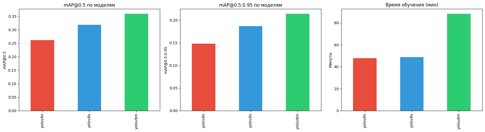
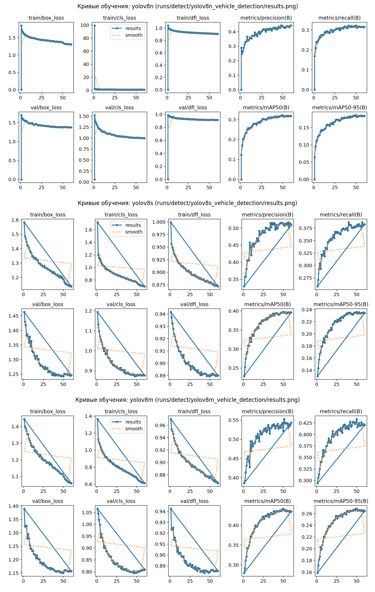

# Отчёт: детекция автотранспорта на аэрофото (YOLOv8)

Выпускной проект курса DLS (Detection), продуктовый трек.

## Датасет

[VisDrone2019-DET](https://www.kaggle.com/datasets/kushagrapandya/visdrone-dataset) (AISKYEYE, Tianjin University) — кадры с дронов, 10 классов участников дорожного движения: pedestrian, people, bicycle, car, van, truck, tricycle, awning-tricycle, bus, motor.

| Split | Изображений | Назначение |
|---|---|---|
| train | 6471 | обучение |
| val | 548 | валидация во время обучения (early stopping, выбор лучшего чекпоинта) |
| test | 1610 | финальная оценка, отложенная выборка |

Разметка переведена из нативного формата VisDrone (абсолютные пиксельные координаты, построчный `.txt`) в формат YOLO (нормализованные координаты центра и размеров бокса). Код конвертации — `notebooks/train_vehicle_detection.ipynb`, раздел 3.

## Модели и настройки обучения

Обучены три модели одного семейства — YOLOv8n, YOLOv8s, YOLOv8m — с нуля (предобученные веса COCO, дообучение на VisDrone). Общие параметры: 60 эпох, `imgsz=640`, `patience=15` (ранняя остановка), оптимизатор подобран автоматически (`optimizer=auto`, AdamW).

## Результаты на тестовой выборке

| Модель | mAP@0.5 | mAP@0.5:0.95 | Precision | Recall | Время обучения |
|---|---|---|---|---|---|
| YOLOv8n | 0.261 | 0.148 | 0.370 | 0.284 | 47.5 мин |
| YOLOv8s | 0.319 | 0.187 | 0.436 | 0.336 | 48.2 мин |
| YOLOv8m | 0.360 | 0.214 | 0.492 | 0.373 | 88.0 мин |

Точность растёт от n к m по всем метрикам, но не пропорционально времени обучения: YOLOv8m обучается почти вдвое дольше YOLOv8s, а прирост mAP@0.5 составляет только 4 пункта (0.319 → 0.360). YOLOv8n и YOLOv8s обучаются почти за одно и то же время (разница 40 секунд), при этом YOLOv8s даёт заметно лучший mAP@0.5 (+5.8 пункта). По соотношению точность/время среди трёх моделей это лучший вариант.

### Метрики по классам (YOLOv8m, лучшая модель)

| Класс | Instances | Precision | Recall | mAP@0.5 | mAP@0.5:0.95 |
|---|---|---|---|---|---|
| car | 28074 | 0.729 | 0.737 | 0.751 | 0.492 |
| bus | 2940 | 0.727 | 0.547 | 0.606 | 0.437 |
| van | 5771 | 0.487 | 0.428 | 0.417 | 0.282 |
| truck | 2659 | 0.482 | 0.498 | 0.468 | 0.313 |
| pedestrian | 21006 | 0.552 | 0.278 | 0.305 | 0.127 |
| motor | 5845 | 0.470 | 0.366 | 0.331 | 0.137 |
| awning-tricycle | 599 | 0.402 | 0.247 | 0.225 | 0.131 |
| tricycle | 530 | 0.296 | 0.347 | 0.208 | 0.113 |
| people | 6376 | 0.519 | 0.120 | 0.165 | 0.059 |
| bicycle | 1302 | 0.261 | 0.163 | 0.123 | 0.051 |

Модель детектирует `car` и `bus` лучше всего (mAP@0.5 выше 0.6). Хуже всего — `bicycle` и `people` (mAP@0.5 ниже 0.17).

## Кривые обучения

Loss (box/cls/dfl) убывает монотонно на всех трёх моделях без признаков переобучения — val loss не растёт к концу обучения. Метрики (precision, recall, mAP) выходят на плато к 40–50-й эпохе, дальнейшие эпохи дают минимальный прирост. Это означает, что запас в 60 эпох был достаточным — упор в потолок метрик, а не в нехватку времени обучения.

## Анализ результатов

**Какая модель быстрее обучилась?** YOLOv8n и YOLOv8s почти идентичны по времени (47.5 и 48.2 минуты) — разница на уровне погрешности, несмотря на то, что YOLOv8s больше по числу параметров (11.1M против 3.0M). YOLOv8m ощутимо медленнее — 88 минут, в основном из-за большего batch time при том же числе эпох.

**Какая модель точнее?** YOLOv8m лидирует по всем метрикам, но прирост от YOLOv8s к YOLOv8m (mAP@0.5: +0.041) меньше прироста от YOLOv8n к YOLOv8s (mAP@0.5: +0.058), а времени на обучение уходит вдвое больше. При ограниченном вычислительном бюджете YOLOv8s — разумный компромисс.

**Почему получены именно такие результаты по классам:**

- Сильный дисбаланс классов в датасете — `car` (28074 объектов в тесте) кардинально преобладает над `tricycle` (530) и `awning-tricycle` (599). Модель видела на порядки больше примеров машин, чем рикш, и это прямо отражается в разнице mAP (0.751 у car против 0.208–0.225 у tricycle/awning-tricycle).
- `pedestrian` и `people` — второй и третий по частоте классы в датасете (21006 и 6376 объектов), но при этом дают одни из самых низких mAP (0.305 и 0.165). Причина не в нехватке данных, а в специфике съёмки с дрона: люди на аэрофото занимают мало пикселей, часто сливаются с фоном или друг с другом в плотных сценах — типичная для VisDrone проблема детекции мелких объектов.
- Recall у `people` (0.120) заметно ниже precision (0.519) — модель находит малую долю реальных людей на кадре, но то, что находит, — угадывает верно. Это указывает на систематические пропуски, а не на ложные срабатывания.
- `bicycle` — низкие показатели по всем метрикам разом (mAP@0.5 = 0.123). Вероятная причина — сочетание малого числа примеров (1302 объекта, наименьшее среди всех классов кроме tricycle/awning-tricycle) и малого размера объекта на кадре.
- `car` и `bus` — не только частые, но и визуально крупные, контрастные объекты с чёткими границами на аэрофото, что объясняет их лидерство в метриках независимо от размера выборки.

**Как можно улучшить результат:**

1. Увеличить `imgsz` (например, 960 или 1280 вместо 640) — VisDrone снят в высоком разрешении, и уменьшение до 640 при инференсе сильнее всего бьёт по мелким объектам (people, bicycle), которые и так занимают минимум пикселей.
2. Применить oversampling или увеличенный вес loss для редких классов (tricycle, awning-tricycle) — прямой ответ на дисбаланс данных.
3. Использовать tiled inference (например, через SAHI) — разбиение кадра на тайлы перед детекцией должно заметно поднять recall на мелких и плотно расположенных объектах (people, bicycle) без переобучения модели.
4. Дообучение с большим числом эпох маловероятно даст прирост — кривые уже вышли на плато к 40–50 эпохе, узкое место в текущей архитектуре и разрешении, а не в времени обучения.

## Итог

Все три модели встроены в веб-приложение (FastAPI + Streamlit) с возможностью выбора между быстрой (YOLOv8n), сбалансированной (YOLOv8s) и точной (YOLOv8m) моделью — соответствует требованию продуктового трека о выборе из ≥2 моделей. YOLOv8m — модель с лучшим качеством детекции (mAP@0.5 = 0.360 на отложенном test split), YOLOv8s — лучший баланс между качеством и временем обучения/инференса.
